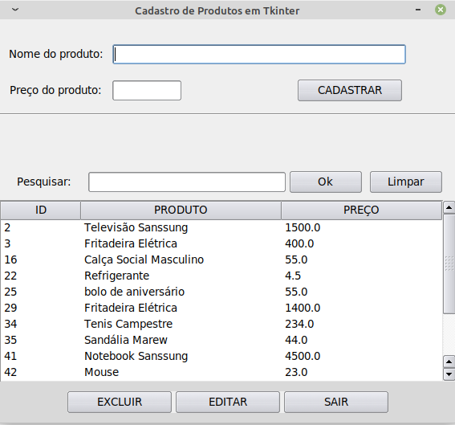
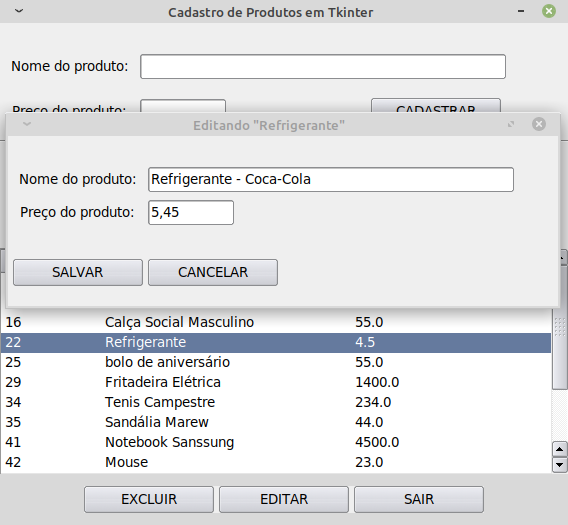
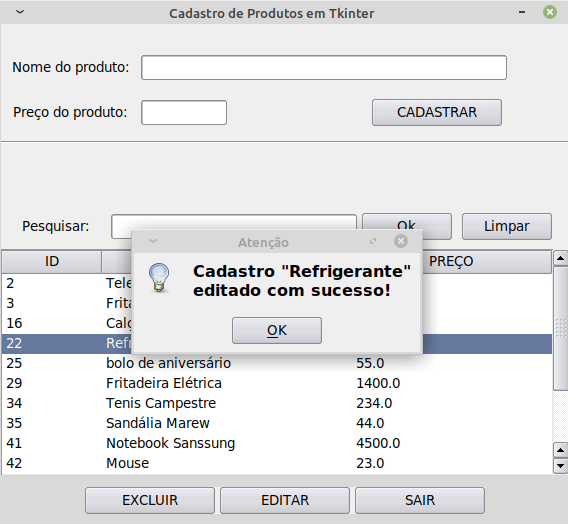
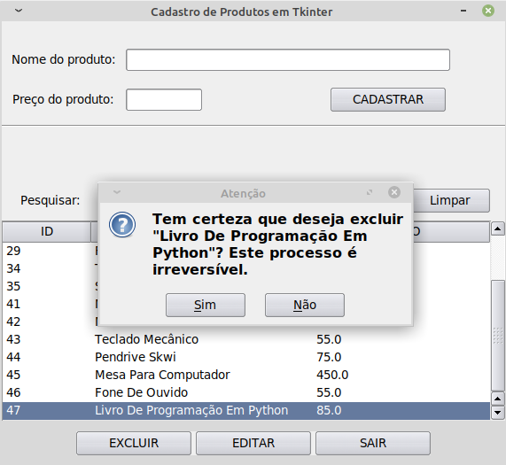

# Cadastro Produtos
  O <b>cadastro Produtos</b> foi desenvolvido em python e tkinter e sqlite3;
É um software simples, Construído apenas para fins didático e de aprendizagem.
  O mesmo tem a capacidade de armazenar um produto e seu preço.
  
### Segue abaixo suas funcionalidades:

<dl>
  <dt> - Tela principal</dt>
    <dd> Campo para novo cadastro</dd>
    <dd> Treeview (Um visualizador em lista)</dd>
    <dd> Botões editar e excluir</dd>
    <dd> Campo para pesquisa</dd>
  <dt> - Tela de edição</dt>
    <dd> Abre uma tela com o item selecionado na lista pronto para editar</dd>
</dl>

  <h3>* Tela principal com uma treeview (list view), com 
  botões de editar e excluir e campo para pesquisa.</h3>
  

<h3>* Abre uma tela com o item selecionado na lista pronto para editar</h3>
  

  <h3>* confirma a edição</h3>
  

  <h3>* confirma a exclusão do item selecionado</h3>
  

